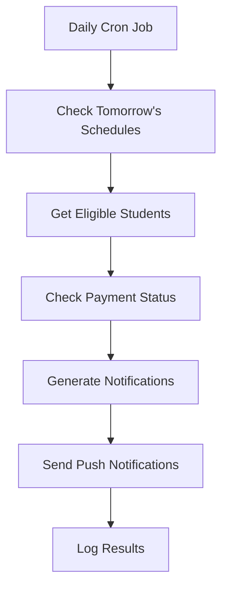
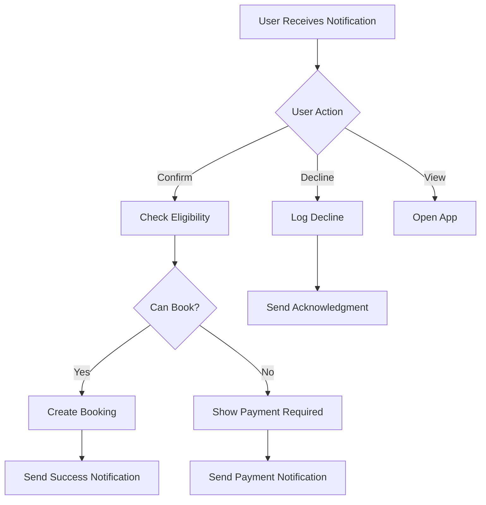

# 🚌 Booking Notification System - TMS Passenger App

## Overview

The Booking Notification System is a comprehensive solution that automatically sends push notifications to students the day before their scheduled trips, allowing them to confirm or decline their bookings directly from the notification. This system enhances user experience and helps optimize bus capacity management.

## 🎯 Features

### Core Functionality
- **Automated Daily Reminders**: Sends notifications 24 hours before scheduled trips
- **Interactive Notifications**: Students can confirm/decline bookings directly from push notifications
- **Payment Integration**: Handles payment requirements for booking confirmations
- **Real-time Updates**: Immediate feedback notifications after user actions
- **Offline Support**: Service worker handles notifications even when app is closed

### Smart Features
- **Eligibility Checking**: Verifies payment status and seat availability before sending reminders
- **Duplicate Prevention**: Prevents multiple reminders for the same trip
- **Retry Logic**: Handles failed notifications with intelligent retry mechanisms
- **Analytics**: Tracks notification effectiveness and user response rates

## 🏗️ Architecture

### System Components

```
┌─────────────────┐    ┌─────────────────┐    ┌─────────────────┐
│   Scheduler     │───▶│  Reminder API   │───▶│ Push Service    │
│   (Daily Cron)  │    │                 │    │                 │
└─────────────────┘    └─────────────────┘    └─────────────────┘
                                │                        │
                                ▼                        ▼
┌─────────────────┐    ┌─────────────────┐    ┌─────────────────┐
│   Database      │◀───│ Booking Actions │◀───│ Service Worker  │
│   (Supabase)    │    │      API        │    │   (Browser)     │
└─────────────────┘    └─────────────────┘    └─────────────────┘
```

### API Endpoints

#### 1. Booking Reminders API
- **GET** `/api/notifications/booking-reminders`
  - Checks for upcoming trips needing reminders
  - Returns list of students and schedules eligible for notifications

- **POST** `/api/notifications/booking-reminders`
  - Sends booking reminder notifications
  - Supports test mode and dry run options

#### 2. Booking Actions API
- **POST** `/api/notifications/booking-actions`
  - Handles user responses (confirm/decline) from push notifications
  - Creates bookings or logs decline actions
  - Sends follow-up notifications

#### 3. Scheduler API
- **GET** `/api/notifications/scheduler` (Manual trigger)
- **POST** `/api/notifications/scheduler` (Automated execution)
  - Orchestrates daily reminder process
  - Includes cleanup and maintenance tasks

#### 4. Test API
- **GET/POST** `/api/test/booking-notifications`
  - Comprehensive testing suite for all notification flows
  - Supports various test scenarios

## 📱 Push Notification Flow

### 1. Daily Scheduler Process


### 2. User Interaction Flow


## 🛠️ Implementation Details

### Database Schema

#### New Tables
1. **scheduler_runs**: Tracks automated scheduler executions
2. **booking_actions_log**: Logs user responses to notifications

#### Enhanced Tables
- **notifications**: Added metadata, expires_at, scheduled_at columns
- **push_subscriptions**: Added user_agent, last_used_at columns

### Service Worker Features
- **Push Event Handling**: Receives and displays notifications
- **Notification Click Handling**: Processes user interactions
- **Background Sync**: Handles offline actions
- **Caching Strategy**: Optimizes performance and offline support

### Push Notification Service
- **Subscription Management**: Handles VAPID subscriptions
- **Interactive Notifications**: Supports action buttons
- **Permission Handling**: Manages notification permissions
- **Error Recovery**: Handles failed subscriptions gracefully

## 🚀 Setup Instructions

### 1. Environment Variables
```env
# VAPID Keys for Push Notifications
NEXT_PUBLIC_VAPID_PUBLIC_KEY=your_vapid_public_key
VAPID_PRIVATE_KEY=your_vapid_private_key

# Scheduler Security
SCHEDULER_SECRET_KEY=your_scheduler_secret_key

# Base URL for API calls
NEXT_PUBLIC_BASE_URL=https://your-domain.com
```

### 2. Database Migration
```sql
-- Run the migration file
\i supabase/migrations/20250915_booking_notifications.sql
```

### 3. Service Worker Registration
```typescript
// In your main app component
import { pushNotificationService } from '@/lib/push-notifications';

useEffect(() => {
  // Initialize push notifications
  pushNotificationService.setStudentId(studentId);
  
  // Request permission if needed
  if (pushNotificationService.getPermissionStatus() === 'default') {
    pushNotificationService.requestPermission();
  }
}, [studentId]);
```

### 4. Cron Job Setup
Set up a daily cron job to trigger the scheduler:
```bash
# Run daily at 7 PM (19:00)
0 19 * * * curl -X POST https://your-domain.com/api/notifications/scheduler \
  -H "Content-Type: application/json" \
  -d '{"schedulerKey":"your_scheduler_secret_key"}'
```

## 🧪 Testing

### Manual Testing
```bash
# Test reminder generation
curl "https://your-domain.com/api/test/booking-notifications?testType=reminder_generation"

# Test full flow
curl -X POST https://your-domain.com/api/test/booking-notifications \
  -H "Content-Type: application/json" \
  -d '{"testType":"full_flow","skipNotifications":true}'
```

### Component Testing
```typescript
// Test push notification functionality
await pushNotificationService.testBookingReminder();

// Test notification UI
<BookingReminderNotifications studentId={studentId} />
```

## 📊 Analytics & Monitoring

### Key Metrics
- **Reminder Delivery Rate**: Percentage of notifications successfully sent
- **Response Rate**: Percentage of students who respond to reminders
- **Confirmation Rate**: Percentage of students who confirm bookings
- **Error Rate**: Failed notifications and booking actions

### Database Functions
```sql
-- Get reminder statistics
SELECT * FROM get_booking_reminder_stats('2025-09-01', '2025-09-30');

-- Cleanup old data
SELECT * FROM cleanup_old_booking_data(90);
```

## 🔧 Configuration

### Admin Settings
```json
{
  "booking_notifications": {
    "enabled": true,
    "reminder_time": "19:00",
    "days_before": 1,
    "retry_failed": true,
    "max_retries": 3,
    "cleanup_after_days": 90,
    "notification_types": {
      "booking_reminder": true,
      "booking_confirmed": true,
      "booking_failed": true,
      "payment_reminder": true
    },
    "delivery_methods": {
      "push_notification": true,
      "email": false,
      "sms": false
    }
  }
}
```

## 🚨 Error Handling

### Common Issues & Solutions

1. **Push Subscription Failures**
   - Check VAPID key configuration
   - Verify HTTPS setup
   - Handle permission denials gracefully

2. **Notification Not Received**
   - Check service worker registration
   - Verify push subscription is active
   - Test with browser developer tools

3. **Booking Action Failures**
   - Validate payment eligibility
   - Check seat availability
   - Handle concurrent booking attempts

### Monitoring
- Monitor scheduler_runs table for execution status
- Check booking_actions_log for user response patterns
- Track push_subscriptions for inactive subscriptions

## 🔒 Security Considerations

### Data Protection
- Student data is encrypted in transit and at rest
- Push subscriptions use secure VAPID authentication
- API endpoints require proper authentication

### Privacy
- Notifications contain minimal personal information
- User actions are logged for analytics only
- Subscription data is automatically cleaned up

## 📈 Performance Optimization

### Caching Strategy
- Service worker caches critical resources
- API responses cached appropriately
- Database queries optimized with indexes

### Scalability
- Batch processing for large student populations
- Efficient database queries with proper indexing
- Asynchronous notification sending

## 🔄 Maintenance

### Daily Tasks (Automated)
- Send booking reminders
- Process user responses
- Update subscription status
- Generate analytics reports

### Weekly Tasks
- Clean up old notifications
- Remove inactive subscriptions
- Review error logs
- Update performance metrics

### Monthly Tasks
- Analyze notification effectiveness
- Review and optimize database performance
- Update VAPID keys if needed
- Backup critical data

## 📞 Support & Troubleshooting

### Debug Mode
Enable debug logging by setting:
```env
DEBUG_NOTIFICATIONS=true
```

### Test Endpoints
Use the test API to verify system functionality:
```bash
# Test all components
curl -X POST /api/test/booking-notifications \
  -d '{"testType":"full_flow"}'
```

### Logs Location
- Browser Console: Service worker and push notification logs
- Server Logs: API execution and error logs
- Database: scheduler_runs and booking_actions_log tables

---

## 📝 Changelog

### Version 1.0.0 (2025-09-15)
- Initial implementation of booking notification system
- Interactive push notifications with confirm/decline actions
- Automated daily scheduler
- Comprehensive testing suite
- Analytics and monitoring capabilities

---

*For technical support or feature requests, please contact the development team.*
